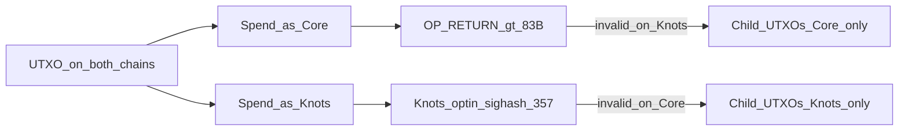

# Replay protection — send control

Normative product rules for **Neapolitan (`neop`)**: same network magic means wire isolation alone is not enough. PoW (SHA-256d vs Blake2b) does **not** stop a transaction that is valid under both tips’ script and policy rules from being replayed.

Use **Core chain** / **Knots chain** in user-facing copy. RPC may still say `flavor=legacy` / `flavor=blake2b` (aliases for Core / Knots). Catalog labels today may still say `legacy_only` / `blake2b_only`; prefer `core_only` / `knots_only` / `both` in new docs and UI.

## Concrete wedges

| Direction | Wedge | Effect |
|-----------|--------|--------|
| **Core-bound spend** | Include an `OP_RETURN` output whose **scriptPubKey is > 83 bytes** | Valid on Core (policy/consensus allow larger OP_RETURN). Invalid on BIP-110 / RDTS / Knots tips that enforce reduced-data `OP_RETURN ≤ 83`. Creates or preserves **Core-only** child UTXOs. |
| **Knots-bound spend** | Opt-in **Knots sighash** ([bitcoinknots/bitcoin#357](https://github.com/bitcoinknots/bitcoin/pull/357)) when enforced on the Knots tip | Tx cryptographically invalid on Core — not merely unbroadcast. Creates or preserves **Knots-only** lineage. |

Knots counts the full `scriptPubKey` length (e.g. `OP_RETURN` + push opcodes + data). A payload of **≥ 81 bytes** of data typically yields scriptPubKey **≥ 84 bytes** and clears the wedge.

### Caveats

- The OP_RETURN wedge depends on the Knots tip still enforcing the ≤83 rule (RDTS window / BIP-110 lineage). If that rule is expired or absent on a tip, fall back to a **unique input** from already Core-only UTXOs (or other documented Core-only ancestry).
- The sighash wedge is unavailable until #357 is live on the Knots tip. Until then, Knots-bound ordinary sends of `both` UTXOs remain **default-deny** unless unique-input or explicit `allow_dual_effect`.
- **Never** claim Blake2b / SHA-256d PoW alone as replay protection.
- Related art: Taproot `OP_IF` split (e.g. bip110swap) may appear later as an optional ceremony; the **primary** Core wedge for neop is **OP_RETURN > 83**.

## Send-control policy (ongoing)

Rules for `neopd` (and any client that must not bypass it):

1. **Catalog** every UTXO with presence on Core / Knots / both (`core_only` / `knots_only` / `both` — map from `legacy_only` / `blake2b_only` when those aliases remain in RPC).
2. Ordinary `send` / `sendrawtransaction` requires a selected chain (`chain` or `flavor`) and **refuses** if any input would still be valid on the non-selected chain **unless**:
   - at least one input is unique to the selected chain, **or**
   - the constructed tx embeds the correct **wedge** for that direction, **or**
   - `allow_dual_effect: true` (logged / UI-gated; never the default).
3. **Broadcast only** to the selected chain’s engine/mempool. Never silent dual-broadcast.
4. On success, return a **confidence receipt**: `{ chain, txid, other_chain_affected: false }` (RPC may still say `flavor` / `other_flavor_affected`).
5. Clients (dashboard, Sparrow, Shrike, Scoop) must not bypass `neopd` for flavor-scoped send when the daemon is the wallet path.

Error when unresolved: `replay_risk_unresolved`.

## Implementation status

| Capability | Status |
|------------|--------|
| Catalog labels (`legacy_only`/`core_only`, `blake2b_only`/`knots_only`, `both`) + `replay_risk` | Wired in `neopd` (`listcoins`; RPC may still emit `legacy_*` / `blake2b_*`) |
| Default-deny send for all-`both` inputs without unique-input or `allow_dual_effect` | Wired (`sendrawtransaction` → `evaluate_send`) |
| Wedge-aware send (OP_RETURN > 83 / #357 sighash detection) | **Planned** — normative here; not yet parsed in `evaluate_send` |
| `protectwallet` / `getreplaystatus` | **Planned** — RPC stubs in [rpc.md](rpc.md) |

Until wedge detection lands, Core-bound `protectwallet` consolidations and ordinary wedge sends remain **manual / out-of-band** (or use unique-input / explicit `allow_dual_effect` through the live RPC).

## One-time wallet protection (`protectwallet`)

Goal: partition replay-exposed coins once so users are not prompted on every spend.

1. **Detect** any `both` UTXOs (pre-split mirrors).
2. **Ceremony** (`protectwallet` / wizard): user confirms once — copy goal: “Protect this wallet from cross-chain replay.”
3. **Core pass:** for each (or batched) `both` UTXO, construct Core-bound consolidations that include OP_RETURN > 83 → broadcast **Core only** → children labeled `core_only`.
4. **Knots pass:** when #357 is available, spend remaining Knots-side mirrors (or a Knots-unique path) with Knots sighash → broadcast **Knots only** → children labeled `knots_only`. If #357 is not live yet: **staged protect** — Core pass now; Knots pass deferred; Knots spends of leftover `both` stay default-deny.
5. **Result:** UTXO set is partitioned; later sends pick a chain and coins already unique to that chain.
6. **Re-protect:** only if new deposits recreate `both` (same script funded on both tips) — banner, not a per-send modal.

## Planned RPC stubs

See [rpc.md](rpc.md):

- `listcoins` — presence + `replay_risk`
- `send` / `sendrawtransaction` — chain-scoped + deny rules above
- `protectwallet` (planned) — `{ dry_run?, chains: ["core","knots"] }` → plan / status
- `getreplaystatus` (planned) — counts of `both` / protected / pending Knots pass

## Related docs

- [architecture.md](architecture.md) — wrapper-first ethos (points here for wedges)
- [rpc.md](rpc.md) — method contract
- [testnet4.md](testnet4.md) — isolation proofs before mainnet
