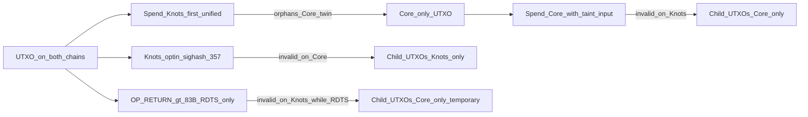

# Replay protection — send control

Normative product rules for **Neapolitan (`neop`)**: same network magic means wire isolation alone is not enough. PoW (SHA-256d vs Blake2b) does **not** stop a transaction that is valid under both tips’ script and policy rules from being replayed.

Use **Core chain** / **Knots chain** in user-facing copy. RPC may still say `flavor=legacy` / `flavor=blake2b` (aliases for Core / Knots). Catalog labels today may still say `legacy_only` / `blake2b_only`; prefer `core_only` / `knots_only` / `both` in new docs and UI.

Lightning **channel** splits are out of band for this page — see [lightning.md](lightning.md) and the linked gist (source of truth).

## Doctrine (order matters)

1. **Taint / unique-input (primary, lasting).** A UTXO that exists on only one chain — typically because its parent was spent differently on the other — makes any spend that includes it invalid on the other tip **by construction**. Core shipped no lasting replay protection; this is the only ongoing way to bind a wallet spend to Core. Neop already accepts this as **unique-input** in `evaluate_send`.
2. **Knots-bound sighash.** Opt-in Knots sighash ([#357](https://github.com/bitcoinknots/bitcoin/pull/357) / `SIGHASH_UNIFIED`) makes a spend cryptographically invalid on Core. Preferred direction for partitioning `both` coins: **Knots first**, then use the orphaned Core twin (or other Core-only ancestry) as taint.
3. **OP_RETURN garnish (temporary).** An `OP_RETURN` output whose **scriptPubKey is > 83 bytes** is invalid on Knots tips that still enforce reduced-data `OP_RETURN ≤ 83` (RDTS / BIP-110). Useful **only while that rule holds** (expires **2027-09-01 00:00 UTC**). Belt-and-braces beside taint — **never** the sole long-term Core guarantee. A garnish-only “protection” becomes a live dual-valid claim when RDTS lapses.

Mantra: **catalog says what you hold; sighash says where Knots txs are valid; input existence (taint) binds a tx to one chain in either direction.**

## Concrete wedges

| Direction | Mechanism | Effect | Longevity |
|-----------|-----------|--------|-----------|
| **Either (preferred Core bind)** | **Taint / unique-input** — at least one input exists only on the selected tip | Tx cannot confirm on the other tip | **Lasting** |
| **Knots-bound spend** | Opt-in **Knots sighash** ([#357](https://github.com/bitcoinknots/bitcoin/pull/357)) when enforced | Cryptographically invalid on Core | **Lasting** (while #357 is consensus on Knots) |
| **Core-bound garnish** | `OP_RETURN` scriptPubKey **> 83 bytes** | Invalid on Knots while RDTS ≤83 holds | **Temporary** — expires 2027-09-01 |

Knots counts the full `scriptPubKey` length (e.g. `OP_RETURN` + push opcodes + data). A payload of **≥ 81 bytes** of data typically yields scriptPubKey **≥ 84 bytes** and clears the RDTS garnish.

Safe wallet split order: **Knots first** (unified), confirm, then spend the Core twin (already Core-only / taint-ready). Never sweep Core twins of a `both` UTXO before the Knots-side spend confirms — that is the split-order trap ([lightning.md](lightning.md)).

### Caveats

- OP_RETURN garnish depends on the Knots tip still enforcing the ≤83 rule. After RDTS expiry (or on a tip without that rule), **taint / unique-input is mandatory** for Core-only effect.
- The sighash wedge is unavailable until #357 is live on the Knots tip. Until then, Knots-bound ordinary sends of `both` UTXOs remain **default-deny** unless unique-input or explicit `allow_dual_effect`.
- **Never** claim Blake2b / SHA-256d PoW alone as replay protection.
- Related art: [bip110-splittor / bip110swap.net](https://github.com/a1denvalu3/bip110-splittor) is a **browser hot wallet + atomic-swap marketplace**. It is **not** part of the Neop stack and the hosted site is not endorsed (keys in `localStorage`; do not fund it). Its Knots-side split idea (`SIGHASH_ALL|UNIFIED` / Knots [#357](https://github.com/bitcoinknots/bitcoin/pull/357)) matches Neop’s Knots wedge. The older gist that described a Taproot `OP_IF` split is stale. **Primary lasting Core protection is taint / unique-input — not OP_RETURN.**

## Send-control policy (ongoing)

Rules for `neopd` (and any client that must not bypass it):

1. **Catalog** every UTXO with presence on Core / Knots / both (`core_only` / `knots_only` / `both` — map from `legacy_only` / `blake2b_only` when those aliases remain in RPC).
2. Ordinary `send` / `sendrawtransaction` requires a selected chain (`chain` or `flavor`) and **refuses** if any input would still be valid on the non-selected chain **unless**:
   - at least one input is unique to the selected chain (**taint**), **or**
   - the constructed tx embeds an accepted **wedge** for that direction (Knots sighash; or Core OP_RETURN > 83 **while RDTS holds**), **or**
   - `allow_dual_effect: true` (logged / UI-gated; never the default).
3. **Broadcast only** to the selected chain’s engine/mempool. Never silent dual-broadcast.
4. On success, return a **confidence receipt**: `{ chain, txid, other_chain_affected: false }` (RPC may still say `flavor` / `other_flavor_affected`).
5. Clients (dashboard, Sparrow, Shrike, Scoop) must not bypass `neopd` for flavor-scoped send when the daemon is the wallet path.

Error when unresolved: `replay_risk_unresolved`.

## Implementation status

| Capability | Status |
|------------|--------|
| Catalog labels (`legacy_only`/`core_only`, `blake2b_only`/`knots_only`, `both`) + `replay_risk` | Wired in `neopd` (`listcoins`; RPC may still emit `legacy_*` / `blake2b_*`) |
| Default-deny send for all-`both` inputs without unique-input or `allow_dual_effect` | Wired (`sendrawtransaction` → `evaluate_send`) |
| Unique-input (taint) acceptance | Wired (`evaluate_send`) |
| Core OP_RETURN garnish detection (scriptPubKey > 83) on `flavor=legacy` | Wired (`neopd.wedges` → `evaluate_send`) — **RDTS-window tooling** |
| Knots #357 sighash wedge detection (`SIGHASH_ALL|UNIFIED` / 0x21 on Taproot key-path witness) | Wired (`neopd.wedges.has_knots_bound_unified_sighash` → `evaluate_send`) when tip enforces it |
| `protectwallet` / `getreplaystatus` | Wired — dry-run plan always; unsigned PSBTs via engine `createpsbt` when `dry_run=false` |

Core-bound ceremony txs with an embedded OP_RETURN garnish may go through `neopd sendrawtransaction` when `flavor=legacy` and `inputs` are catalogued (**temporary** under RDTS). Knots-bound txs with a 0x21 key-path signature may go through `flavor=blake2b`. Sign in Sparrow (Core) or Shrike (Knots); Scoop never holds keys.

## One-time wallet protection (`protectwallet`)

Goal: partition replay-exposed coins once so users are not prompted on every spend.

1. **Detect** any `both` UTXOs (pre-split mirrors).
2. **Ceremony** (`protectwallet` / wizard): user confirms once — copy goal: “Protect this wallet from cross-chain replay.”
3. **Preferred lasting path:** Knots pass first with unified sighash → broadcast **Knots only** → children `knots_only`; then spend Core twins (now Core-only / taint) without relying on OP_RETURN. If #357 is not live, defer Knots pass; do not treat OP_RETURN-only Core passes as permanent.
4. **RDTS-window Core convenience (current tooling):** Core-bound consolidations that include OP_RETURN > 83 → broadcast **Core only** → children labeled `core_only` **while RDTS holds**. Document to operators that this is temporary garnish; re-protect with taint before RDTS expiry if those children must stay Core-bound forever.
5. **Result:** UTXO set is partitioned; later sends pick a chain and coins already unique to that chain.
6. **Re-protect:** only if new deposits recreate `both` (same script funded on both tips) — banner, not a per-send modal.

Dust-pool minting and spam-anchored Lightning settlement use the same taint idea at channel scale — see [lightning.md](lightning.md).

## Planned RPC stubs

See [rpc.md](rpc.md):

- `listcoins` — presence + `replay_risk`
- `send` / `sendrawtransaction` — chain-scoped + deny rules above
- `protectwallet` — `{ dry_run?, chains: ["core","knots"], items?, core_payee?, knots_payee? }` → plan / unsigned PSBTs
- `getreplaystatus` — counts of `both` / protected / pending Knots pass

## Related docs

- [lightning.md](lightning.md) — Lightning migration digest; gist is SoT for channel splits
- [architecture.md](architecture.md) — wrapper-first ethos (points here for wedges)
- [rpc.md](rpc.md) — method contract
- [testnet4.md](testnet4.md) — isolation proofs before mainnet
